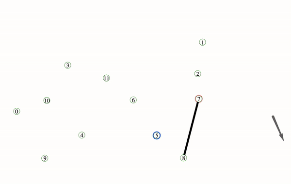
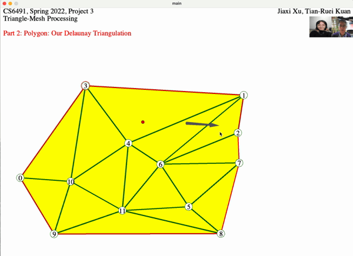

# Triangulation

Authors: Jiaxi Xu, Tian-Ruei Kuan (group project)
Create triangular mesh via both user input and auto generation given vertices.

## Objectives

part 1. Design an efficient interface to let the user create a simple triangle mesh. 
part 2. Given vertices, generates the Delaunay triangulation.

## How to use
Open any file in main folder with Processing, click on Run.
In the application, press '0' to clear first.
press '1' to show part 1. Users can pick an edge to start and choose one vertix at a time via cliking.
press '2' to show part 2. 

## Explanation
part 1.
Keep track of all the boundary edges, use angle bisector to determine which edge the selected vertex is on. If valid, add a new triangular mesh. Also, the Delaunay suggestion is provided. The suggested vertex is circled in blue. If the user deviates from the suggestions, it simply stops. 

part 2.
Given the vertices, generates the Delaunay triangulation with the efficiency of O(n^2). Delaunay triangulation is created such that no vertex is within the circum circle of any 3 vertices of the rest. 

## Result
screen recordnig of the final result

#### part 1: 

#### part 2: 

## Resources
base code: CS6491 Project 3 with Dr.Jarek Rossignac from Gatech

